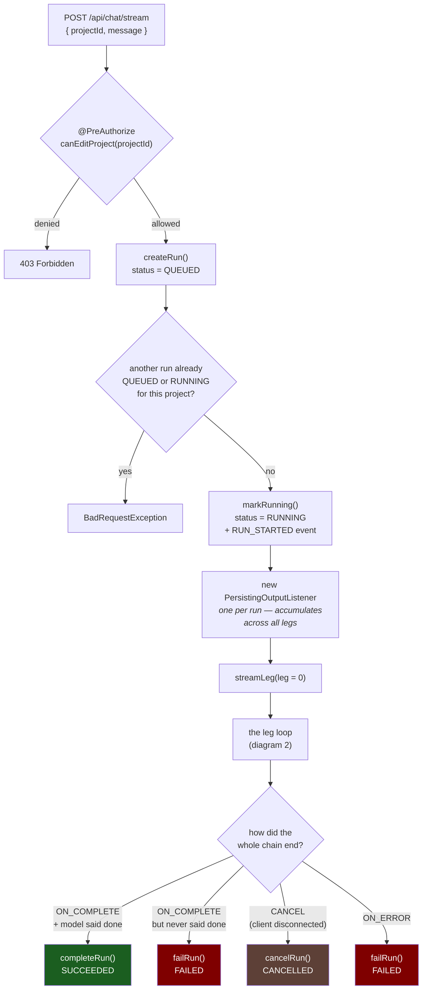
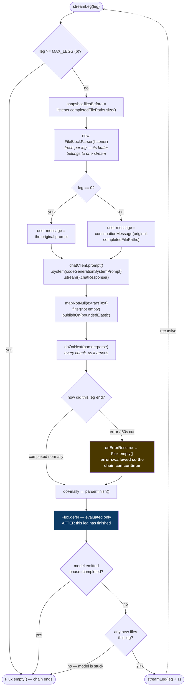
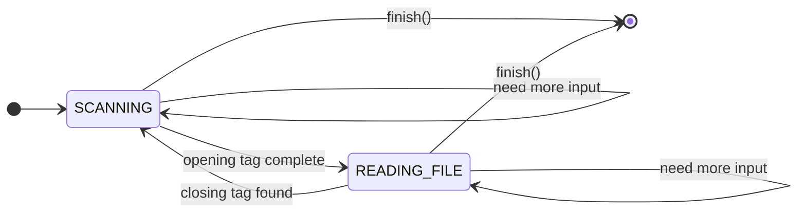
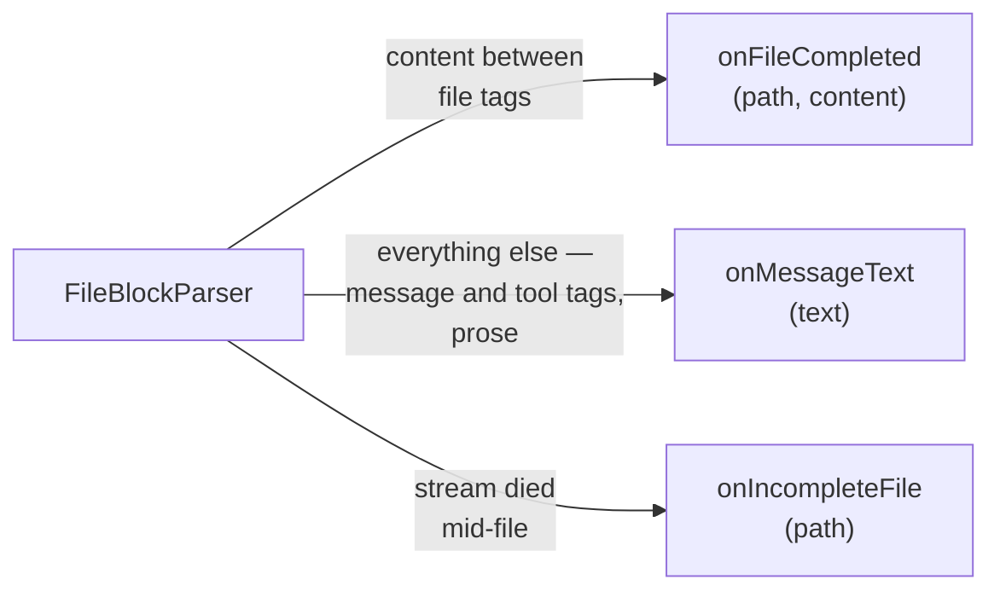
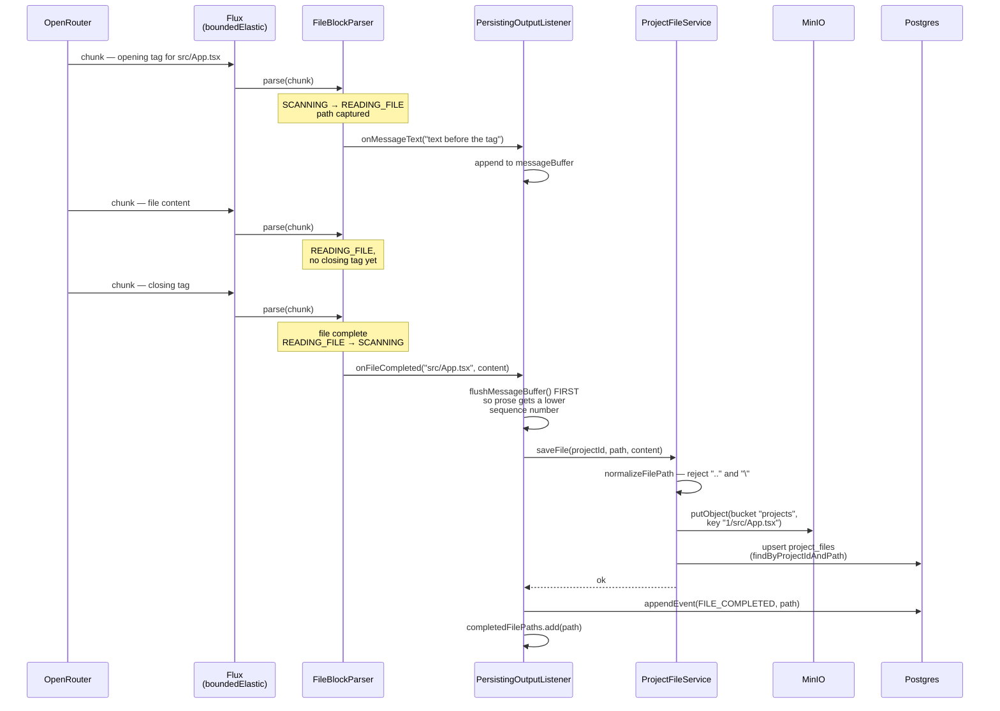
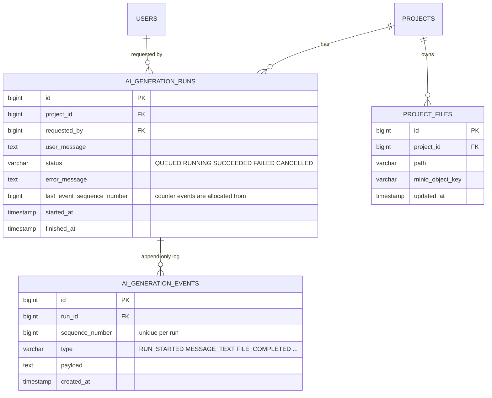
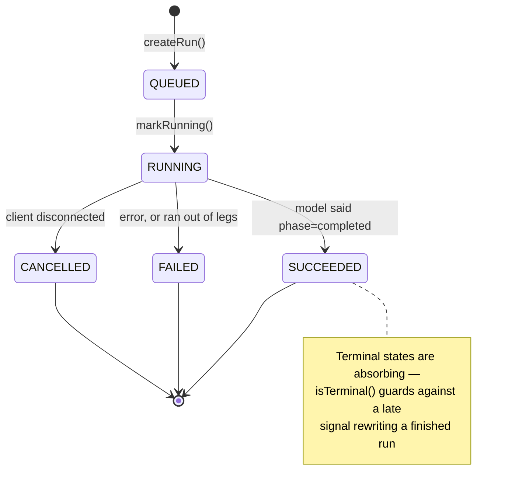

# AI Code Generation — Architecture & Flow

How one chat message becomes a set of generated files in MinIO, with a full audit trail.

**Entry point:** `POST /api/chat/stream` → `AiGenerationServiceImpl.streamResponse()`

---

## The problem this design solves

A single call to the model is not enough to build an app:

- The provider cuts the HTTP stream at roughly **60 seconds**, mid-file
- Buffering everything and parsing at the end means a cut destroys **all** of it
- The model plans 14 files and gets through 5
- When something breaks, there is no record of how far it got

So the generation is split into **legs** (several model calls behind one user request), files are **saved the instant they complete**, and every step is appended to an **immutable event log**.

---

## 1. Big picture — one request, start to finish



Two things worth noticing:

- **Success is not "the stream ended".** It is "the model emitted `phase="completed"`". A stream that ends because six legs ran out is a failure, even though Reactor reports `ON_COMPLETE`.
- **The listener outlives every leg.** It is what remembers which files already exist, so leg 3 does not re-create what leg 1 wrote.

---

## 2. The leg loop — how one prompt becomes several model calls



### The three Reactor details that make this work

| Detail | Why it is required |
|---|---|
| `onErrorResume` **before** `concatWith` | An error terminates a sequence — `concatWith` never runs after one. The 60s cut *arrives* as an error, so without this the chain dies after leg 0. |
| `Flux.defer` around the stop check | Without it the condition is evaluated once at assembly time, before any leg has run, when nothing is complete. `defer` postpones it until the previous leg actually finishes. |
| `publishOn(boundedElastic)` | `parser.parse()` reaches all the way to a MinIO upload and several JPA writes — all blocking. It also guarantees **sequential** delivery on one worker, which is why the parser needs no synchronisation. |

### Three independent stop conditions

1. The model emitted `<message phase="completed">`
2. The leg produced **no new files** (it is stuck or repeating itself)
3. `leg >= MAX_LEGS`

Condition 2 matters most — it is what prevents an unbounded loop against a rate-limited provider.

### What a real run looks like

```
leg 0   ~60s   index.html, main.tsx, index.css, types.ts,
               useTodos.ts, TodoForm.tsx              6 saved
               TodoItem.tsx                           cut mid-file

leg 1   ~60s   TodoItem.tsx                           saved
               TodoList.tsx                           cut mid-file

leg 2   ~40s   TodoList.tsx, FilterTabs.tsx,
               StatsBar.tsx, App.tsx                  4 saved
               <message phase="completed">            → SUCCEEDED
```

Eleven files from one user request. The truncated files were discarded and regenerated in the next leg, because a file only enters `completedFilePaths` when its closing tag arrives.

---

## 3. FileBlockParser — turning a token stream into files

The model streams XML-ish text in arbitrary fragments. A tag can be split anywhere:

```
chunk 1:  "Here you go <file pa"
chunk 2:  "th=\"a.ts\">const x = 1;</fi"
chunk 3:  "le> done"
```

The parser is a small state machine over a rolling buffer. It has **zero dependencies** — no Spring, no database, no MinIO — which is what makes it testable in isolation.



Every transition in full:

| State | Trigger | Action | Next |
|---|---|---|---|
| `SCANNING` | no opening tag in the buffer | emit all but the last **11** characters as message text; keep the tail | `SCANNING` |
| `SCANNING` | opening tag found, path not finished arriving | emit only the text *before* the tag; wait | `SCANNING` |
| `SCANNING` | complete opening tag | capture the path, emit preceding text, consume the tag | `READING_FILE` |
| `READING_FILE` | no closing tag yet | keep accumulating content | `READING_FILE` |
| `READING_FILE` | closing tag found | `onFileCompleted(path, content)`, consume the tag | `SCANNING` |
| `SCANNING` | `finish()` | emit whatever text remains | *done* |
| `READING_FILE` | `finish()` | `onIncompleteFile(path)` — partial content discarded | *done* |

The two "need more input" self-transitions are the reason a split tag is harmless: the parser never fails on an incomplete fragment, it simply keeps it and waits for the next chunk.

### Why it holds back 11 characters

The opening tag `<file path="` is 12 characters. In the `SCANNING` state, if that search **fails**, the buffer may still *end* with a partial tag — anything from `<` up to `<file path=`, which is 11 characters. It cannot end with all 12, because then the search would have succeeded.

So 11 is the **minimum safe holdback**:

- hold back fewer → a real tag gets cut in half and the whole file is emitted as chat text, silently
- hold back more → correct, but chat text is needlessly delayed

It is written as `FILE_TAG_START.length() - 1` so the number follows the tag if the format ever changes.

### Two output channels



The parser never decides what to *do* with either channel — that is the listener's job. This separation is why the same parser can be driven by a unit test with no infrastructure at all.

---

## 4. Saving a file — parser callback to MinIO and Postgres



### Ordering rules encoded here

**Flush prose before saving the file.** Sequence numbers *are* the log's ordering, so the message that preceded a file must get a lower number than the file itself. Flushing first guarantees it.

**Save to MinIO before appending the event.** The log records what *has happened*. If the event were appended first and the upload then failed, the log would permanently claim a file that does not exist — and an append-only log cannot be corrected.

**MinIO object key is `projectId + "/" + path`** — so a project's files live under a `1/` prefix in the `projects` bucket, not at the root.

---

## 5. GenerationRun and GenerationEvent — state vs. history

Think of a bank account:

- **The balance** is one number. Current state, cheap to read. → `AiGenerationRun`
- **The transaction list** is many rows, append-only, never edited. The full truth. → `AiGenerationEvent`

You could recompute the balance by replaying every transaction, but you keep both, because answering "is this running?" should not require reading 400 rows.



### The run's status lifecycle



`QUEUED` and `RUNNING` rows are also swept to `FAILED` at startup by `InterruptedRunRecovery`: a run cannot survive a process restart, so anything still `RUNNING` when the app boots was interrupted. Without it, a crash mid-generation would leave a row that blocks that project forever.

### How a sequence number is allocated

```mermaid
sequenceDiagram
    participant L as Listener
    participant S as AiGenerationRunService
    participant DB as Postgres

    rect rgb(20, 50, 80)
    Note over S,DB: ONE @Transactional unit
    L->>S: appendEvent(runId, type, payload)
    S->>DB: SELECT run (first-level cache after the first call)
    S->>S: next = lastEventSequenceNumber + 1
    S->>DB: UPDATE run SET last_event_sequence_number = next
    S->>DB: INSERT event (run_id, next, type, payload)
    end
```



Both writes must land together. If the counter advanced and the insert then failed, sequence 5 would be burned and the next event would be 6 — a permanent hole in a log whose entire purpose is being complete.

The unique constraint on `(run_id, sequence_number)` is the backstop: today one thread appends per run, but if a second writer ever appears you get a **loud constraint violation** instead of two events silently claiming the same position.

### What a real run's log looks like

| seq | type | payload |
|----:|------|---------|
| 1 | `RUN_STARTED` | *null* |
| 2 | `MESSAGE_TEXT` | `I'll create a TODO app...` |
| 3 | `FILE_COMPLETED` | `index.html` |
| 4 | `FILE_COMPLETED` | `src/main.tsx` |
| 5 | `FILE_COMPLETED` | `src/index.css` |
| … | … | … |
| 9 | `FILE_INCOMPLETE` | `src/components/TodoItem.tsx` |
| 10 | `MESSAGE_TEXT` | `I'll create the remaining components...` |
| 11 | `FILE_COMPLETED` | `src/components/TodoItem.tsx` |
| … | … | … |
| 21 | `MESSAGE_TEXT` | `<message phase="completed">Created...` |
| 22 | `RUN_COMPLETED` | *null* |

Events 9–11 are a leg boundary: `TodoItem.tsx` was cut, discarded, and regenerated in the next leg. **Nothing in the stream itself marks the boundary** — the client sees one continuous SSE stream, which is the point.

Payloads carry **paths, never file content**. A generated file can be 50 KB; duplicating it into the log would double storage for nothing, and replay after a reconnect should return a few KB of metadata, not half a megabyte of TypeScript. The content lives in MinIO, and `FileController` serves it by path.

---

## Object lifetimes

The single most important thing to keep straight:

| Object | Lifetime | Created by | Why |
|---|---|---|---|
| `AiGenerationRun` | one request | `createRun()` | the durable record of the job |
| `PersistingOutputListener` | **one run** | `new` in `streamResponse` | must remember completed files *across* legs |
| `FileBlockParser` | **one leg** | `new` in `streamLeg` | its buffer and state describe one stream |
| `AiGenerationRunService` | application | Spring singleton | stateless |
| `ProjectFileService` | application | Spring singleton | stateless |

The parser and the listener are **not Spring beans**, and deliberately so: a `@Component` is a singleton, and both hold state belonging to a single generation. Two users generating at once would shred each other's buffers.

> Spring beans are for stateless, long-lived collaborators. Objects with mutable state tied to a single operation are created with `new`.

---

## Known gaps

| Gap | Effect |
|---|---|
| Per-response file cap ignored | It sits under "Output Format" in the prompt, read as formatting trivia. Legs still run to the 60s wall. |
| Tool protocol references a tool that does not exist | Continuation messages always list files, which triggers "read the files first" → the model emits a tool tag and stops. Worked around by an override block in `continuationMessage`. |
| Cross-leg consistency | Later legs see only *paths* of earlier files, not their contents — so `App.tsx` named-imported a default export. Phase 4's fixed plan is the real fix. |
| 60s client timeout unresolved | `RealCall.timeoutExit` proves it is OkHttp's own call timeout; the Spring AI timeout properties do not bind. Sidestepped by keeping legs short. |
| No parser tests | `FileBlockParser` is pure and trivially testable. A split-at-every-position test would have caught both bugs it shipped with. |
| Not resumable | The job still dies with the HTTP connection. Phase 3b (`Last-Event-ID` replay over the event log) is what fixes that. |
